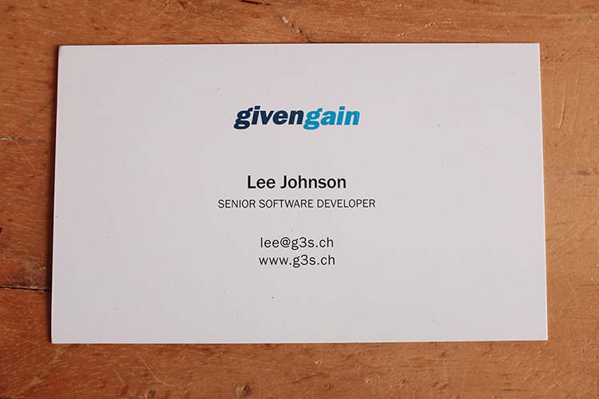
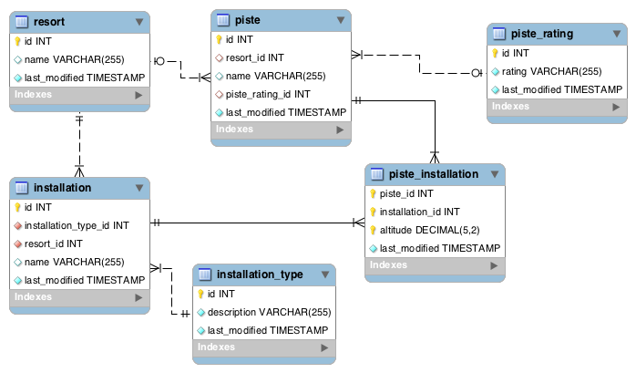

Battling a Legacy Schema With DBIx::Class

[Lee Johnson](http://leejo.github.io)

YAPC::{NA,EU} 2016

---
## Me?



[http://leejo.github.io/code](http://leejo.github.io/code)

---
## Why DBIx::Class?

For any non-trivial application you're going to write a model anyway.

Most trivial applications turn into non-trivial applications.

So "don't leak the abstraction"

DBIx::Class offers many useful features, as we shall see.

Note:
- quote from Ovid
- no writing same SQL over and over
- concentrate on the business logic
- objects

---
### More about that Model

The ORM isn't your model, it *helps* your model.

<p class="fragment"> MVC </p>
<p class="fragment"> <font size=40>M</font>V<font size=3>C</font> </p>
<p class="fragment"> <font size=5>O</font><font size=40>M</font>V<font size=3>C</font> </p>

Note:
- thin controllers, fat model + ORM

---
### More about that Model

Abstract this away into your model:

```perl
$model->resultset( "Piste" )->find( 17 )->name;
```

Like so:

```perl
SkiResort::Model::Piste->new( id => 17 )->name;
```

You're controllers are then not coupled to the data store

And they know nothing about the ORM

Note:
- example: ./examples/slides/more_about_that_model.sh 17 (+ exception)
- controller(s) not tightly coupled to the schema
- model code makes the decisions on storage

---
### More about that Model

And you can better utilise exceptions:

```
try sub {
	...
	my $piste = SkiResort::Model::Piste->new( id => $piste_id );
	...
},
catch_when 'SkiResort::Exception::Database' => sub {
	# 500 error?
},
catch_when 'SkiResort::Exception::Input' => sub {
	# 400 error?
},
catch_default sub {
	# something else?
};
```

---
## Legacy Schema?

<p class="fragment"> Anything you didn't design yourself, right? </p>
<p class="fragment"> Well, anything that's grown organically. </p>
<p class="fragment"> Or used older tech and didn't keep up. </p>
<p class="fragment"> Maybe just full of technical debt? </p>
<p class="fragment"> Technical debt is *hard* to fix in your data store. </p>
<p class="fragment"> It's more like a mortgage on your stack. </p>
<p class="fragment"> So lets look at some examples. </p>

Note:
- tech debt: because often the code is tightly coupled to it
- mortgage: takes a long time to pay off, makes moving difficult, missing a payment can be catastrophic.
- a well designed schema: you can just about point DBIx::Class at it and run
- but we can still use dbic with a legacy schema, just needs some help
- following: how we can abstract problems away to ease paying off that debt.

---



A Ski Resort

Note:
- This is not the "legacy" schema
- This is done "right" (potentially subjective)
- Simple enough but also can have complexity

---
## Relationships (or lack thereof)

Note:
- there was once an aversion to these
- "they're slow"
- "they don't give us anything"
- "they make queries over complicated"
- The R in "RDBMS" is important

---
## Generating schema classes


---
## Adding relationships


---
## Solving joins on polymorphic relationships


---
## Filtering columns


---
## Fixing data types with filters


---
## Virtual views and reports


---
## Query tracing and profiling


---
## Gotchas


---
## In Summary

+ Thin controllers, fat model
    - The ORM is *not* your model
    - Use it *in* your model
+ Foo
+ Boz
+ Biz

---
## Questions?

Links and resources:
