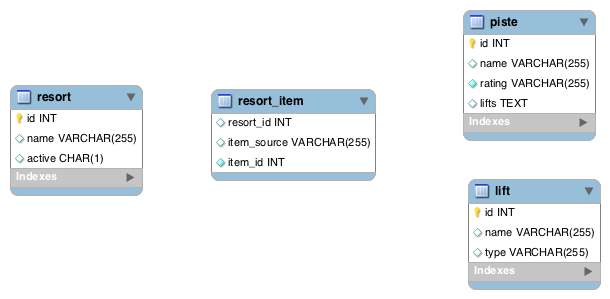
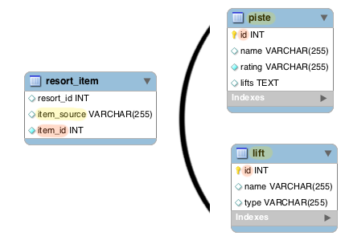

Battling a Legacy Schema With DBIx::Class

[Lee Johnson](http://leejo.github.io)

YAPC::{NA,EU} 2016

---
## Me?


[http://leejo.github.io/code](http://leejo.github.io/code)

---
## Why DBIx::Class?

<p class="fragment"> For any non-trivial application you're going to write a model. </p>

<p class="fragment"> Most trivial applications turn into non-trivial applications. </p>

<p class="fragment"> And you're probably sick of writing trivial SQL. </p>

<p class="fragment"> So your trivial SQL statements ... right? </p>

<p class="fragment"> "don't leak the abstraction" </p>

<p class="fragment"> DBIx::Class offers many useful features, as we shall see. </p>

<p class="fragment"> Other ORMs/toolkits are available. </p>

Note:
- my first intro to dbic, don't want to go back
- no writing same SQL over and over
- quoting Ovid, who was quoting Joel Spolsky
- concentrate on the business logic
- objects
- DBIx::Class is not just an ORM, it's a toolkit (plugins, etc)

---
### More About That Model

The ORM isn't your model, it *helps* your model.

<p class="fragment"> MVC </p>
<p class="fragment"> <font size=40>M</font>V<font size=3>C</font> </p>
<p class="fragment"> <font size=5>O</font><font size=40>M</font>V<font size=3>C</font> </p>

Note:
- thin controllers, fat model + ORM

---
### More About That Model

Abstract this away into your model:

```perl
$model->resultset( "Piste" )->find( 17 )->name;
```

Like so:

```perl
SkiResort::Model::Piste->new( id => 17 )->name;
```

Your controllers are then not coupled to the data store

And they know nothing about the ORM

Note:
- example: ./examples/slides/more_about_that_model.sh 17 (+ exception)
- controller(s) not tightly coupled to the schema
- model code makes the decisions on storage

---
### More About That Model

And you can better utilise exceptions:

```perl
try sub {
	...
	my $piste = SkiResort::Model::Piste->new( id => $piste_id );
	...
},
catch_when 'SkiResort::Exception::Database' => sub {
	# 500 error?
},
catch_when 'SkiResort::Exception::Input' => sub {
	# 400 error?
},
catch_default sub {
	# something else?
};
```

---
## Legacy Schema?

<p class="fragment"> Anything you didn't design yourself, right? </p>
<p class="fragment"> Well, anything that's grown organically. </p>
<p class="fragment"> Or used older tech and didn't keep up. </p>
<p class="fragment"> Maybe just full of technical debt? </p>
<p class="fragment"> Technical debt is *hard* to fix in your data store. </p>
<p class="fragment"> It's more like a mortgage on your stack. </p>
<p class="fragment"> So lets look at some examples. </p>

Note:
- tech debt: because often the code is tightly coupled to it
- mortgage: takes a long time to pay off, makes moving difficult, missing a payment can be catastrophic.
- a well designed schema: you can just about point DBIx::Class at it and run
- but we can still use dbic with a legacy schema, just needs some help
- following: how we can abstract problems away to ease paying off that debt.

---


A Ski Resort

Simple, [right?](img/villars_piste_map.pdf)

Note:
- This is done "right" (potentially subjective)
- Show villars_piste_map.pdf
- Because, for example, resort can be made of other resorts
- And a piste can be made of other pistes
- And you can have lifts that link resorts
- But keeping this simple enough for the examples
- And this is not the "legacy" schema...

---

The "legacy" version:



Eh, not so good.

Note:
- This is the legacy schema
- Purposefully simplistic

---
## High Level Overview

```
11:31 <@ribasushi> if you have an existing gnarly database you want to wrap your head
                   around, vanstyn_'s rdbic is a superb tool building on top of the
                   ecosystem: http://www.catalystframework.org/calendar/2014/16
```

[RapidApp](https://github.com/RapidApp/yn2015)

```
rdbic.pl examples/db/legacy/resorts_legacy.db
```

Note:
- example: ./examples/slides/high_level_overview.sh

---
## Confusing Terminology

<p class="fragment"> If you don't leak the abstraction then this becomes a non-issue. </p>

<p class="fragment"> Because your `SkiResort::Model::Piste` class could be querying a table named potato. </p>

<p class="fragment"> But if doesn't matter, the confusing terminology is safely contained and you only ever interact with the correctly named class. </p>

Note:
- a re-purposed schema

---
## Relationships (or lack thereof)

Note:
- there was once an aversion to these
- "they're slow"
- "they don't give us anything"
- "they make queries over complicated"
- The R in "RDBMS" is important

---
## Generating Schema Classes

```bash
#!/bin/bash

set -e
set -x

folder=$1
db_path=$2
overwrite=$3

dbicdump \
        -o debug=1 -o generate_pod=0 -o preserve_case=1 \
        -o dump_directory=$folder \
        -o components="[qw{InflateColumn::DateTime}]" \
        -o overwrite_modifications=$overwrite \
        -o datetime_timezone=UTC \
                'SkiResort::Model::LegacySchema' \
                'dbi:SQLite:dbname='$db_path''
```

Note:
- cd examples; sh db/gen_dbic_classes.sh lib db/legacy/resorts_legacy.db 1
- useful to have this as a script to rerun as required

---
## Generating Schema Classes

```perl
use utf8;
package SkiResort::Model::LegacySchema::Result::ResortItem;

# Created by DBIx::Class::Schema::Loader
# DO NOT MODIFY THE FIRST PART OF THIS FILE

use strict;
use warnings;

use base 'DBIx::Class::Core';
__PACKAGE__->load_components("InflateColumn::DateTime");
__PACKAGE__->table("resort_item");
__PACKAGE__->add_columns(
  "resort_id",
  { data_type => "integer", default_value => \"null", is_nullable => 1 },
  "item_source",
  { data_type => "varchar( 255 )", is_nullable => 1 },
  "item_id",
  { data_type => "integer", is_nullable => 0 },
);


# Created by DBIx::Class::Schema::Loader v0.07036 @ 2016-04-07 14:16:33
# DO NOT MODIFY THIS OR ANYTHING ABOVE! md5sum:kOaW4xm7IT+Y3qVDDBy2hg

# You can replace this text with custom code or comments, and it will be
# preserved on regeneration
1;
```

Note:
- gives us the base but we need to add relationships
- the relationships are where we can really use the power of dbic

---
## Adding Relationships

```perl
# You can replace this text with custom code or comments, and it will be
# preserved on regeneration

__PACKAGE__->belongs_to(
  "resort",
  "SkiResort::Model::LegacySchema::Result::Resort",
  { id => "resort_id" },
  { is_deferrable => 0, on_delete => "CASCADE", on_update => "CASCADE" },
);

```

Which gives us:

```perl
$model->resultset( "ResortItem" )
	->first->resort->name;
```

And of course:

```perl
$model->resultset( "ResortItem" )->search(
	{},{ prefetch => [ qw/ resort / ] }
)->first->resort->name;
```

Note:
- example: ./examples/slides/adding_relationships.sh
- probably only want to add relationships as you need them
- i.e. no point in spending time adding them all
- but prefetch is an essential concept in optimisation

---
## Adding Relationships

[DBIx::Class::Relationship](https://metacpan.org/pod/DBIx::Class::Relationship)

 * `might_have` = 0 .. 1
 * `has_many`   = 0 .. n
 * `belongs_to` = The right hand side of the above:
  * If a Resort `has_many` Piste(s) then a Piste `belongs_to` a Resort
 * (`many_to_many` = [convenience](https://metacpan.org/pod/distribution/DBIx-Class/lib/DBIx/Class/Manual/Glossary.pod#Relationship-bridge))

Note:
- belongs_to is really the one true representative relationship
- as foreign keys in a schema definition only ever say what they "belong to"
- many_to_many is literally an accessor, there is no metadata behind it
- see [this](https://github.com/dbsrgits/dbix-class/blob/master/lib/DBIx/Class/Relationship/ManyToMany.pm#L64-L77)

---
## Polymorphic Relationships?



Note:
- if you've ever seen a table that has a column to store the name of another table, then...
- seems like an elegant solution, but:
- can't enforce referential integrity in the storage engine
- pushes the relational implementation into your application code
- OK, but what if we have one of these and we can't yet fix it?

---
## Polymorphic Relationships?

```perl
package SkiResort::Model::LegacySchema::Result::ResortItem;

...

__PACKAGE__->set_primary_key( "resort_id","item_source","item_id" );

__PACKAGE__->belongs_to(
  piste => 'SkiResort::Model::LegacySchema::Result::Piste',
  sub {
    my ( $args ) = @_;

    return {
      "$args->{self_alias}.item_source" => 'piste',
      "$args->{self_alias}.item_id"   => { -ident => "$args->{foreign_alias}.id" },
    };
  },
);
```

Allows:

```perl
$model->resultset( "PisteItem" )->search(
    { item_source => 'piste' },
    { prefetch => [ qw/ piste / ] }
)->first->piste->name;
```

Note:
- example: ./examples/slides/polymorphic_relationships.sh

---
## Polymorphic Relationships?

Using `many_to_many` bridge having added the previous belongs_to:

```perl
package SkiResort::Model::LegacySchema::Result::Resort;

...

__PACKAGE__->has_many(
  resort_items => 'SkiResort::Model::LegacySchema::Result::ResortItem',
  { 'foreign.resort_id' => 'self.id' }
);

__PACKAGE__->many_to_many(
  'pistes' => 'resort_items' => 'piste'
);
```

Allows:

```perl
$model->resultset( "Resort" )->first->pistes->first->name;
```

Note:
- example: ./examples/slides/polymorphic_relationships_mtm.sh
- note difference: ->first->piste**s**->first->name
- compared to: ->first->piste->name
- can't use prefetch (many_to_many isn't a relationship)

---
## Polymorphic Relationships?

And if you have many of these:

```perl
package SkiResort::Model::LegacySchema::Result::ResortItem;

...

foreach my $source ( qw/ piste lift / ) {

  __PACKAGE__->belongs_to(
    $source => 'SkiResort::Model::LegacySchema::Result::' . ucfirst( $source ),
    sub {
      my ( $args ) = @_;

      return {
        "$args->{self_alias}.item_source" => $source,
        "$args->{self_alias}.item_id"   => { -ident => "$args->{foreign_alias}.id" },
      };
    },
  );

}
```

Note:
- example: ./examples/slides/polymorphic_relationships_lift.sh

---
## Fixing Column Data

---
## Inflating Column Data

We can fix data and/or get objects from column data.

[DateTime](https://metacpan.org/pod/DBIx::Class::InflateColumn::DateTime) - You'll almost certainly want this one:

```perl
__PACKAGE__->load_components(qw/InflateColumn::DateTime/);
```

When `$column` is a `date`, `timestamp` or `datetime` data type:

```perl
$model->resultset( "Foo" )->first->$column->subtract->( months => 1 )->ymd;
```

<p class="fragment">`DATE_FORMAT(DATE_SUB(c,INTERVAL 1 MONTH),'%Y-%m-%d')`</p>

<p class="fragment">Stop using your RDMS to do date calculations / format.</p>

Note:
- we can both inflate and *deflate*
- e.g. ensuring data is encrypted
- DBIx::Class::InflateColumn::*
- a couple of these are core to DBIx::Class, e.g. InflateColumn::DateTime
  - has ways to handle timezones, locale, etc

---
## Fixing Column Data With Filters

The `resort` table contains an `active` column that is a `char(1)`.

It should be a `boolean`, so:

```perl
package SkiResort::Model::LegacySchema::Result::Resort;

...

__PACKAGE__->load_components( "FilterColumn" );

__PACKAGE__->filter_column( active => {
	filter_to_storage   => sub { return $_[1] ? 'Y' : 'N'; },
	filter_from_storage => sub { return defined $_[1] && $_[1] =~ /Y/i ? 1 : 0; },
});
```

Cleans up significantly:

```perl
if ( $model->resultset( "Resort" )->first->active ) {
	...
}
```

Note:
- DBIx::Class::FilterColumn
- ./examples/slides/fixing_column_data_with_filters.sh

---
## Fixing Column Data With Filters

How about sanity checking a column that contains a CSV list?

```perl
__PACKAGE__->filter_column( column_with_csv => {

	filter_from_storage   => sub { return [ split( ',',$_[1] ) ]; },

	filter_to_storage => sub {
		my ( $self,$values ) = @_;

		foreach my $value ( @{ $values // [] } ) {
			# maybe we can check $value here - if it's supposed
			# to be a reference to another table then we could
			# check $value exists in the child table? if not we
			# throw an exception
		}

		return join( ',',@{ $values // [] } ) || undef;
	},
});
```

Note:
- Text::CSV
- Manually enforce referential integrity

---
## Complex Queries

```perl
my $sql = "Some complex SQL we don't want to rewrite as SQL::Abstract";
```

Options:

* [dbh_do](https://metacpan.org/pod/DBIx::Class::Storage::DBI#dbh_do)
* [DBIx::Class::ResultSource::View](https://metacpan.org/pod/DBIx::Class::ResultSource::View)
* [DBIx::Class::Report](https://metacpan.org/pod/DBIx::Class::Report)

Note:
- You *can* rewrite most (if not all) SQL, but you need to find a balance
- DBIC_TRACE if you need to debug your SQL::Abstract struct (more later)
- dbh_do, low level db handle (with exceptions)
- Virtual views - views, but virtual!
- Report - on demand virtual views (ALPHA code)

---
## dbh_do

```perl
my @results = $schema->storage->dbh_do(
	sub {
		my ( $storage,$dbh,@binds ) = @_;

		# this is just pure DBI
		$dbh->selectrow_array( "Complex SQL Here",{},@binds );
	},
	@binds,
);
```

Note:
- straight out of the docs
- using this rather than ->_dbh or ->dbh ensures correct exception handling and reconnection

---
## Virtual Views

---
## Virtual Views Extended

---
## Reports

[DBIx::Class::Report](https://metacpan.org/pod/DBIx::Class::Report)

Note:
- Just link and show perldoc here, explain ALPHA code
- It's just building up virtual views at runtime

---
## Query Tracing and Profiling

* `DBIC_TRACE=1` or `DBIC_TRACE=1=/path/to/output/file`
* `DBIC_TRACE_PROFILE=console` - for pretty printing
* `DBI_TRACE=1` - if you're using dbh_do

```perl
use Carp qw/ longmess shortmess /;

sub resultset {
	my ( $self,$table ) = @_;

	if ( my $trace = $ENV{DBIC_TRACE} ) {
		my ( $level,$trace_file ) = split( /=/,$trace );
		my $mess = $level == 1
			? shortmess( "RESULTSET: $table" )
			: longmess( "RESULTSET: $table" );
		if ( $level && $trace_file ) {
			open( my $fh,'>>',$trace_file ) || cluck( ... );
			print $fh $mess;
			close( $fh );
		} else {
			print STDERR $mess;
		}
	}

	return $self->SUPER::resultset( $table );
}
```

Note:
- what i've been using in the examples
- console_monochrome if you don't want colours
- put the sub in your Schema.pm module
- shows you potential ->resultset calls missing prefetch
- as seen in examples, e.g. ./examples/slides/adding_relationships.sh

---
## Gotchas

Prefetch prefetch prefetch.

---
## In Summary

+ Thin controllers, fat model
    - The ORM is *not* your model
    - Use it *in* your model
+ DBIx::Class can be thought of as a toolkit, not just an ORM
+ Boz
+ Biz

---
## Questions?

Links and resources:

---
### Bonus SQL Anti-Patterns!
